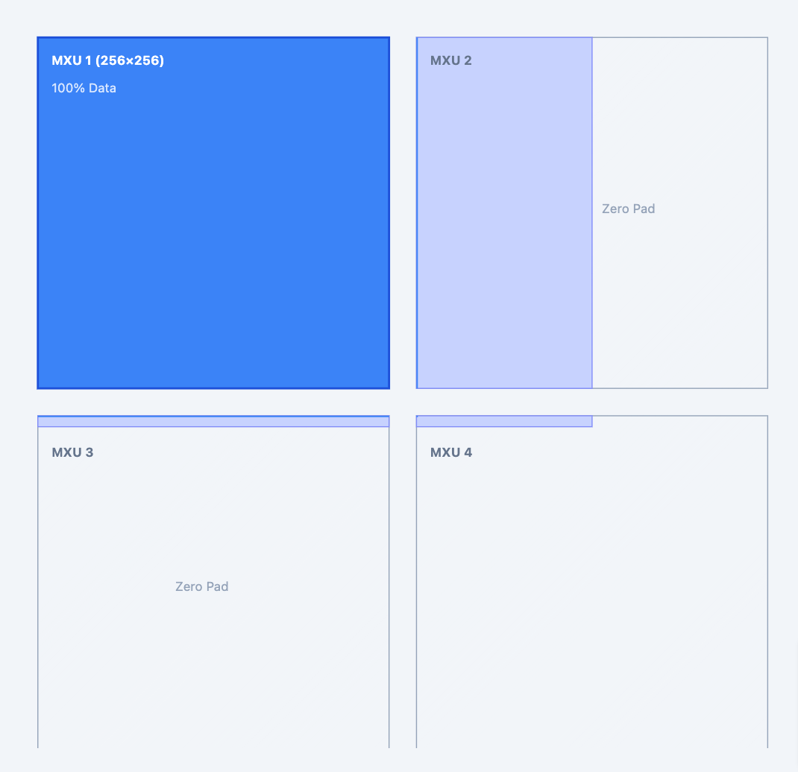

# TPU Matmul Benchmark & Shape Analysis

This project provides tools to benchmark Matrix Multiplication (Matmul) operations on TPU using [JAX](https://github.com/jax-ml/jax) and [Pallas](https://jax.readthedocs.io/en/latest/pallas/index.html). It focuses on analyzing performance characteristics across different dimensions (M, N, K) and investigating the impact of padding on performance.

**Conclusion:** The matrix padding strategy follows an (8, 128) alignment, meaning the first dimension aligns to a multiple of 8 and the second to a multiple of 128. For the weight matrix (the right-hand side of the matmul), it is ultimately fixed onto the MXU in the form of multiple (256, 256) blocks. For the data matrix, it enters the MXU for calculation as (8, 128) blocks after padding. In M, N, K matrix multiplication, padding in N and K severely degrades performance, whereas the performance loss from padding M is minimal. Additionally, observing the benchmark timings reveals that, given a weight matrix of (256, 256), increasing M helps improve computational efficiency (where computation time exceeds other overheads).

Further observations indicate that changing the weight matrix from (256, 256) to (256, 512) results in a linear increase in latency, implying that it does not leverage two MXUs in parallel. Moreover, for weight matrices of shape (128, 256) or (256, 128), the latency is remarkably close to that of (256, 256) when M is large.

## Benchmarking Tool: `bench.py`

The core script `bench.py` executes a custom Pallas kernel to perform matrix multiplication (`X @ W`). It uses a rigorous methodology to measure kernel latency and throughput.

### Methodology

1.  **Pallas Kernel**: Defines a custom TPU kernel using `pl.pallas_call` with `pl_tpu.CompilerParams`.
2.  **Loop Amortization**: Wraps the matmul operation in a `jax.lax.fori_loop` within the kernel to execute it multiple times (N iterations) in a single launch.
3.  **Linear Regression**: Runs the benchmark for varying loop counts (e.g., 5000, 10000, 20000). It performs linear regression on the total execution time versus loop count to isolate:
    *   **Slope**: The true per-iteration latency (ns).
    *   **Intercept**: The base overhead of the kernel launch.
4.  **Mosaic Dumps**: Automatically configures `LIBTPU_INIT_ARGS` to dump Mosaic representations to `/tmp/mosaic_dumps/` for compiler analysis.

### Usage

**Single Run Mode:**

Run a specific shape configuration directly from the command line.

```bash
python bench.py --m 2048 --n 2048 --k 2048 --dtype bfloat16
```

**Batch Mode:**

Run a suite of test cases defined in CSV files (`test_case_normal.csv` and `test_case_padding.csv`).

```bash
python bench.py --batch
```

This command reads the input CSVs, executes the benchmark for each row, and generates corresponding `_results.csv` files.

---

## Benchmark Results

The following tables summarize the performance results collected from the batch runs.

### 1. Normal Test Cases

Standard shapes (typically powers of 2) to establish baseline performance.

| M | N | K | Dtype | Per-Iter Latency (ns) | Compute Metric |
| :--- | :--- | :--- | :--- | :--- | :--- |
| 256 | 32 | 32 | BF16 | 133.46 | 0.2 |
| 256 | 32 | 64 | BF16 | 137.11 | 0.38 |
| 256 | 32 | 128 | BF16 | 145.07 | 0.72 |
| 256 | 32 | 256 | BF16 | 164.85 | 1.27 |
| 256 | 32 | 512 | BF16 | 206.11 | 2.04 |
| 256 | 64 | 64 | BF16 | 136.71 | 0.77 |
| 256 | 64 | 128 | BF16 | 145.6 | 1.44 |
| 256 | 64 | 256 | BF16 | 165.13 | 2.54 |
| 256 | 64 | 512 | BF16 | 204.78 | 4.1 |
| 256 | 128 | 128 | BF16 | 147.73 | 2.84 |
| 256 | 128 | 256 | BF16 | 165.43 | 5.07 |
| 256 | 128 | 512 | BF16 | 203.66 | 8.24 |
| 128 | 256 | 256 | BF16 | 165.95 | 5.06 |
| 256 | 256 | 256 | BF16 | 184.98 | 9.07 |
| 256 | 512 | 256 | BF16 | 222.34 | 15.09 |
| 512 | 256 | 256 | BF16 | 221.91 | 15.12 |
| 512 | 256 | 512 | BF16 | 295.79 | 22.69 |
| 512 | 512 | 256 | BF16 | 295.44 | 22.72 |
| 512 | 512 | 512 | BF16 | 445.07 | 30.16 |
| 512 | 32 | 32 | BF16 | 151.88 | 0.35 |
| 512 | 32 | 64 | BF16 | 156.81 | 0.67 |
| 512 | 32 | 128 | BF16 | 165.61 | 1.27 |
| 512 | 32 | 256 | BF16 | 218.14 | 1.92 |
| 512 | 32 | 512 | BF16 | 293.26 | 2.86 |
| 512 | 64 | 64 | BF16 | 156.19 | 1.34 |
| 512 | 64 | 128 | BF16 | 166.22 | 2.52 |
| 512 | 64 | 256 | BF16 | 218.7 | 3.84 |
| 512 | 64 | 512 | BF16 | 293.64 | 5.71 |
| 512 | 128 | 128 | BF16 | 169.35 | 4.95 |
| 512 | 128 | 256 | BF16 | 217.59 | 7.71 |
| 512 | 128 | 512 | BF16 | 293.91 | 11.42 |
| 64 | 256 | 256 | BF16 | 157.26 | 2.67 |
| 128 | 256 | 256 | BF16 | 165.96 | 5.05 |
| 256 | 256 | 256 | BF16 | 185.33 | 9.05 |
| 512 | 256 | 256 | BF16 | 222.05 | 15.11 |
| 1024 | 256 | 256 | BF16 | 295.22 | 22.73 |
| 2048 | 256 | 256 | BF16 | 440.79 | 30.45 |
| 4096 | 256 | 256 | BF16 | 734.63 | 36.54 |
| 1024 | 256 | 512 | BF16 | 442.04 | 30.36 |
| 1024 | 512 | 256 | BF16 | 442.65 | 30.32 |
| 1024 | 512 | 512 | BF16 | 736.16 | 36.46 |
| 2048 | 256 | 512 | BF16 | 735.85 | 36.48 |
| 2048 | 512 | 256 | BF16 | 734.22 | 36.56 |
| 2048 | 512 | 512 | BF16 | 1323.83 | 40.55 |
| 4096 | 512 | 512 | BF16 | 2497.22 | 43.0 |

### 2. Padding Test Cases

These tests observe performance when dimensions are slightly off-alignment (e.g., +1), which typically forces padding mechanisms to engage.

| M | N | K | Dtype | Per-Iter Latency (ns) | Compute Metric |
| :--- | :--- | :--- | :--- | :--- | :--- |
| 256 | 256 | 256 | BF16 | 184.75 | 9.08 |
| 256 | 256 | 257 | BF16 | 221.8 | 7.59 |
| 256 | 257 | 256 | BF16 | 221.1 | 7.62 |
| 257 | 256 | 256 | BF16 | 188.52 | 8.93 |
| 256 | 257 | 257 | BF16 | 270.77 | 6.24 |
| 257 | 257 | 256 | BF16 | 225.88 | 7.49 |
| 512 | 512 | 512 | BF16 | 443.96 | 30.23 |
| 512 | 512 | 513 | BF16 | 590.64 | 22.77 |
| 512 | 513 | 512 | BF16 | 588.93 | 22.83 |
| 512 | 513 | 513 | BF16 | 785.32 | 17.16 |
| 513 | 512 | 512 | BF16 | 451.15 | 29.81 |
| 513 | 513 | 513 | BF16 | 829.7 | 16.27 |


### Analysis of Padding Overhead

The following diagram illustrates the impact of slight dimension mismatches (e.g., 257 vs 256) on hardware utilization.



**Conclusion:** When dimensions slightly exceed the native tile size (e.g., 256), the system must pad the data to fill the next available tile structure. As shown in the diagram, a 257x257 matrix operation cannot fit into a single 256x256 block. Instead, it effectively requires a 2x2 grid of blocks (utilizing 4 MXU-equivalents of tiling space), where three of these blocks are almost entirely filled with "Zero Pad". This drastic increase in required allocation for a minimal increase in useful data explains the sharp drop in compute metric and increased latency observed in the benchmark results.

